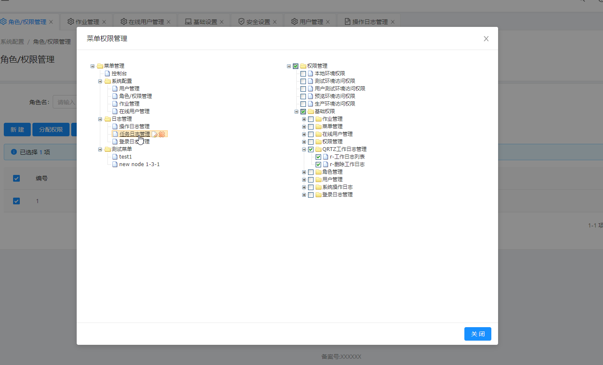
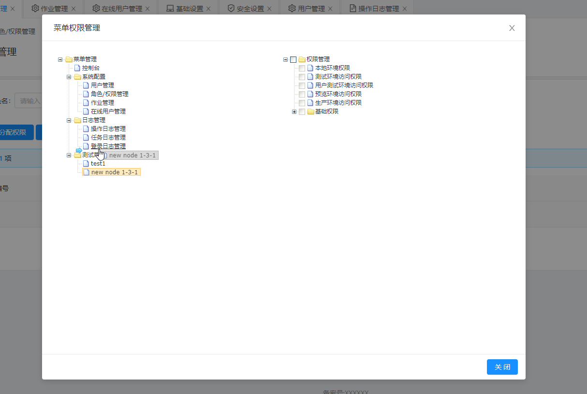
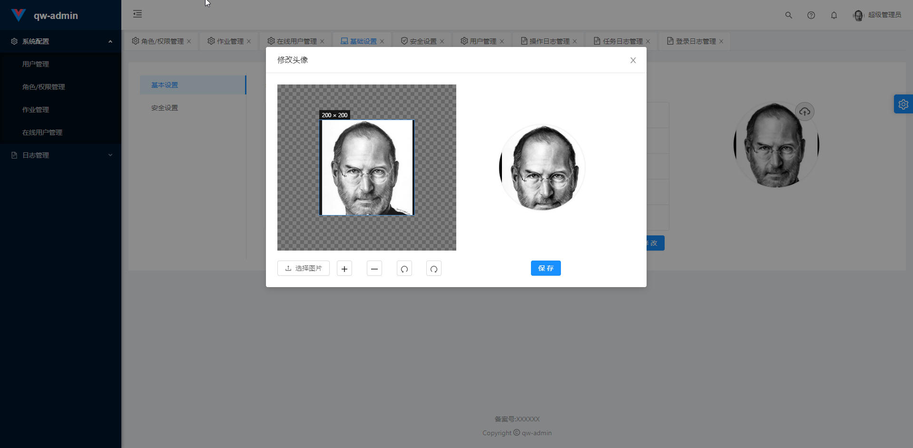

# qw-admin

# 一、介绍

基于 Spring Boot、Shiro 的快速开发管理系统。

> 现阶段未单体项目，后期考虑采用 java9 之后的模块化拆分系统。

# 二、软件架构

- 后端技术
  - Spring Boot 2.0.0
  - Apache Shiro
  - Spring Data JPA
  - Mybatis Plus
  - Thymeleaf
  - Ehcache
  - ...
- 前端技术
  - requirejs
  - vue.js(2+)
  - vue-router
  - vue-store
  - jquery
  - antd-vue
  - antd-vue-pro
  - lodash

> **注意: **

# 三、安装教程

[快速启动教程](./doc/quickly-start.md)

# 四、使用说明

## 1、后端

参看 [qw-admin-server使用说明](doc/server-readme.md)

## 2、前端

参看 [qw-admin-web使用说明](doc/client-readme.md)

​	

# 五、效果预览

# 六、参与贡献

1.  Fork 本仓库
2.  新建 Feat_xxx 分支
3.  提交代码
4.  新建 Pull Request
5.  有问题请评论区留言

