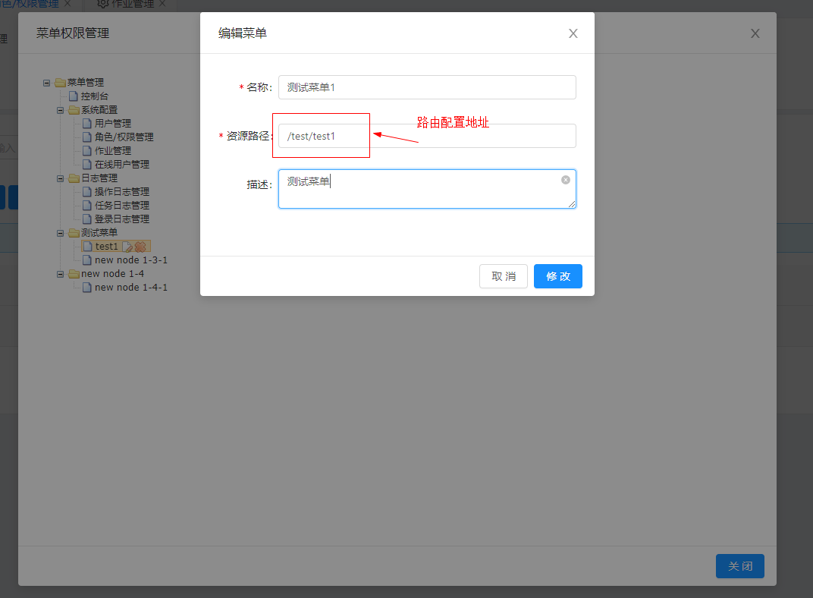

# 1、简介

> 参看 [简介](client-instruction.md)

# 2、项目目录结构

- `qw-admin-web/static`
  - `apis`
    - `assets`
      - `animations` - lottile 动画效果库
      - `libs` - 包含部分项目中用到的第三方库
    - `components` - vue 组件
    - `img` - 项目图片文件夹
    - `layout` - 项目中用到的
    - `mock` - mockjs
    - `pages` - 页面文件
    - `require-config - require`- 相关文件
      - `modules` - requirejs 模块目录
      - `plugins` - requirejs 插件目录
      - `index.js` - requirejs 配置文件
    - `router` - vue-router 配置文件目录
    - `store` - vuex 配置文件目录
    - `utils` - 工具函数目录
    - `App.vue` - 根组件（入口组件）
    - `favicon.ico` - 网页图标
    - `index.dev.html` - dev 开发环境入口
    - `index.html` - prd 环境入口
    - `index.js` - 入口 js

# 3、配置

## 3.1、开发环境配置

见 `index.dev.html`, 相关配置如下：

```html
<script type="text/javascript">
    if ('ActiveXObject' in window) {
        var ele = document.getElementById('loading-mask');
        ele.style.display = 'none';
        document.write('对不起，不支持IE，请使用其他非 IE 内核浏览器访问，比如：360、Firefox、Chrome 浏览器');
    } else {
        // 当前项目版本号, 
        window.__version__ = '1.1.1';
        // 当前环境 dev | prd，dev 环境下将会开启 source-map 和 vue-dev-tool 功能。
        window.__env__ = 'dev';
        // 当前静态访问基础路径，该路径访问需要满足如下规则:
        // 访问 [window.__app__]/a.js => qw-admin-web/static/a.js
        window.__app__ = '/web-admin';
        // 访问服务器 api 接口的基础路径
        window.__server_base_url__ = '/admin';
        // ajax 访问超时时间
        window.__timeout__ = 180;
        // 是否开启动态加载功能，已经实现，开发中觉得没什么用，暂时不提供服务端实现代码
        // 如有需要请留言。
        window.__hot_reload__ = false;
        // 动态加载服务端地址
        window.__hot_reload_server__ = 'http://localhost:8080/imserver';
    }
</script>
<!--注意版本号和 window.__version__ 相对应，服务端每次更新静态文件之后将 window.__version__ 修改，能够保证客户端缓存失效 -->
 <script type="text/javascript" src="/web-admin/assets/libs/requirejs/require.min.js?browser_spa_version=1.1.1"></script>
	<!--edge 浏览器需要此插件支持 -->
    <!-- <script type="text/javascript" src="/web-admin/assets/libs/polyfill/polyfill.min.js?browser_spa_version=1.1.1"></script> -->
    <script type="text/javascript" src="./require-config/index.js?browser_spa_version=1.1.1"></script>
    <script type="text/javascript" src="./index.js?browser_spa_version=1.1.1"></script>
```

## 3.2、项目关键配置

见 `require-config/modules/config.js`，相关配置如下：

```javascript
define([], function () {
    var process = {
        // 当前运行环境
        ENV : window.__env__
    };
    var env = '';

    switch (process.ENV) {
        case 'dev':
        case 'test':
            env = 'development';
            break;
        case 'prd':
            env = 'production';
            break;
    }

    return {
        env: env,
        version: window.__version__ || '1.0',
        timeout: window.__timeout__,
        serverBaseUrl: window.__server_base_url__ || '/admin',
        routerMode: window.__router_mode__ || 'hash',
        // 别名配置开始，类似于 webpack 中的别名，可以在组件加载其他组件的时候使用别名指定需要加载的组件
        // 的位置，不要直接写相对路径或者绝对路径，会导致静态资源路径和目录相对结构强耦合，项目组件过多之后
        // 静态资源路径修改将会很麻烦。
        alias : {
            '@': window.__app__,
            '@R': window.__app__ + '/require-config',
            '@CMP': window.__app__ + '/components',
            '@IMG': window.__app__ + '/img',
            '@UTIL': window.__app__ + '/utils',
            '@PAGE': window.__app__ + '/pages',
            '@MOCK': window.__app__ + '/mock',
            '@ROUTE': window.__app__ + '/router',
            '@STORE': window.__app__ + '/store',
            '@ASSET': window.__app__ + '/assets',
            '@LAYOUT': window.__app__ + '/layouts',
            '@API': window.__app__ + '/apis',
            '@SERVER_IMGS_BASE_URL' : '/imgs/view/find'
        },
        // 全局基于 vue 实现了一个简单的 Bus, 跨组件之间的通信可以使用此方法，
        // 事件名称都定义在此处, 方便其他地方引入（个人习惯，对多人协助开发很有用，也方便项目维护）。
        busEvents: {
            // 会话超时事件
            SESSION_TIMEOUT: 'SESSION_TIMEOUT',
            // 访问资源返回无权限异常
            NO_AUTHORITY: 'NO_AUTHORITY',
            // 多标签模式下关闭指定标签事件
            CLOSE_PAGE: 'CLOSE_PAGE_TAB'
        },
        // 当前是否是 dev 环境
        isDev: function() {
            return this.env === 'development';
        },
        // 当前是否是 prd 环境
        isPrd: function() {
            return this.env === 'production';
        },
        // 将相对 apiUrl 转换为服务端实际 apiUrl
        format2ServerUrl: function(url) {
            var serverBaseUrl = this.serverBaseUrl;
            let len1 = serverBaseUrl.length;
            let prefixUrl = serverBaseUrl[len1 - 1] === '/' ? serverBaseUrl.substring(0, len1 - 1) : serverBaseUrl;
            let subfixUrl = url[0] === '/' ? url : '/' + url;
            return prefixUrl + subfixUrl;
        }
    };
});
```


# 4、开发示例

## <a id="ch4-01">4.1、新增页面</a>

1、添加新页面，路径: `/static/pages/test/test1.vue`

```vue
<template>
  <div>
    <div class="wrapper">
      <a-alert message="Success Tips" type="success" show-icon></a-alert>
      <a-alert message="Informational Notes" type="info" show-icon></a-alert>
      <a-alert message="Warning" type="warning" show-icon></a-alert>
      <a-alert message="Error" type="error" show-icon></a-alert>
      <a-alert
        message="Success Tips"
        description="Detailed description and advices about successful copywriting."
        type="success"
        show-icon
      >
      </a-alert>
      <a-alert
        message="Informational Notes"
        description="Additional description and informations about copywriting."
        type="info"
        show-icon
      >
      </a-alert>
      <a-alert
        message="Warning"
        description="This is a warning notice about copywriting."
        type="warning"
        show-icon
      >
      </a-alert>
      <a-alert
        message="Error"
        description="This is an error message about copywriting."
        type="error"
        show-icon
      >
      </a-alert>
    <div>
  </div>
</template>

<script lang="es6">
module.exports = {
  name: 'test1-page',  
  data () {
    return {
      message: 'this is a test page!'
    }
  },
  methods: {
    
  }
}
</script>
<style scoped>
div.wrapper {
  padding: 5px 15px;
  background-color: #FFF;
}
div.wrapper > div {
  margin-top: 10px;
}
h1 {
  color: red;
}
</style>
```

2、添加新路由，路径: `/static/router/index.js`

```javascript
// ...
var router = new Router({
    mode: Conf.routerMode,
    routes: [
        // ...
        {
            path: '/index',
            name: 'home',
            component: MenuView,
            redirect: '/system',
            meta: {
                menuName: '主页'
            },
            children: [
                {
                    path: '/test',
                    redirect: '/test/test1',
                    name: '测试功能',
                    component: PageView,
                    children: [
                        {
                            path: 'test1',
                            name: 'test-1',
                            component: load('@PAGE/test/test1')
                        },
                    ]
                }
            ]
        }
    ]
});
// ...
```

3、由于左侧菜单数据由后台返回，需要再系统中添加该路由

> 为什么不采用网上流行的根据后台菜单节点动态生成路由的方式？这是为了左侧菜单结构与目录结构脱离耦合，既路由结构不等于菜单结构，当然实际开发中您可以根据自己的喜好配置为相同或者不同。




3、刷新页面，效果如下：


> **<font color="red">注意:  组件标签请使用双标签模式，即便是单标签，也请使用双标签书写方式！！！</font>** 

## 4.2、数据交互

1. 创建 API 接口描述文件 `/static/apis/test/index.js`，如下：

```javascript
/**
 * 测试环境相关 API。
 */
define([
    'request',
    'axios'
], function(Request, axios) {
  // var $http = Request.$http;
  return {
    /**
     * 查询城市天气
     * @param 城市名称
     */
    queryWeather: function(cityName) {
      // 实际访问的是 /admin/rest/forget 接口
      // return $http.get('/rest/forget');
      // 这里使用一个查询天气的接口做演示
      return axios.get('http://wthrcdn.etouch.cn/weather_mini?city=' + cityName);
    }
  }
});
```


2. 按照 <a href="#ch4-01">4.1</a> 的教程创建创建 `/static/pages/test/test2.vue`，内容如下：

```vue
<template>
  <div>
    <div class="wrapper">
      <a-descriptions title="昨日天气">
        <a-descriptions-item label="日期">
          {{ yesterday.date }}
        </a-descriptions-item>
        <a-descriptions-item label="最高温度">
          {{ yesterday.high }}
        </a-descriptions-item>
        <a-descriptions-item label="风向">
          {{ yesterday.fx }}
        </a-descriptions-item>
        <a-descriptions-item label="最低温度">
          {{ yesterday.low }}
        </a-descriptions-item>
        <a-descriptions-item label="风力">
          {{ yesterday.fl | removeCDATA }}
        </a-descriptions-item>
        <a-descriptions-item label="天气">
          {{ yesterday.type }}
        </a-descriptions-item>
      </a-descriptions>
    <div>
  </div>
</template>

<script lang="es6">
module.exports = asyncRequire([
  'alias!@API/test/index',
  'lodash'
], (TestAPI, _, resolve, reject) => {
  resolve({
    name: 'test2-page',
    data () {
      return {
        city: '昆明',
        forecast: [],
        wendu: 0,
        ganmao: '',
        yesterday: {
          date: '',
          fl: '',
          fx: '',
          high: '',
          low: '',
          type: ''
        }
      }
    },
    filters: {
      removeCDATA (str) {
        let reg = /^\<\!\[CDATA\[([^\]]+)\]\]\>$/;
        if(reg.test(str)) {
          return reg.exec(str)[1];
        }
        return str;
      }
    },
    mounted () {
      this.fetchWeathData();
    },
    methods: {
      fetchWeathData () {
        TestAPI.queryWeather(this.city)
          .then(resp => {
            if(resp.status === 200 && resp.data.status === 1000) {
              return resp.data.data;
            }
            return Promise.reject(resp.desc);
          })
          .then(data => {
            // es6 解析复制不能用, babel 插件解析不了...
            this.forecast = [];
            data.forecast.forEach(item => this.forecast.push(item));
            this.wendu = data.wendu;
            this.ganmao = data.ganmao;
            this.$set(this, 'yesterday', data.yesterday);
          })
          .catch(errMsg => this.$message.error(errMsg));
      }
    }
  });
});
</script>
<style scoped>
div.wrapper {
  padding: 5px 15px;
  background-color: #FFF;
}
</style>
```

- `asyncRequire` 函数为 `require` 函数的 promise 版本，代码如下：

  ```javascript
  function asyncRequire(target) {
      return function(deps, callback) {
          return new Promise(function(resolve, reject) {
              require(deps, function() {
                  var newArgs = [];
                  for(var i = 0; i < arguments.length; i++) {
                      newArgs.push(arguments[i]);
                  }
                  newArgs.push(resolve);
                  newArgs.push(reject);
                  callback.apply(target, newArgs);
              })
          });
      }
  }
  ```

  

- `alias!@API/test/index` 相当于如下代码：

  ```javascript
  require(window.window.__app__ + '/apis/test/index', function(TestAPI) {
     // ... 
  });
  ```

3. 效果


